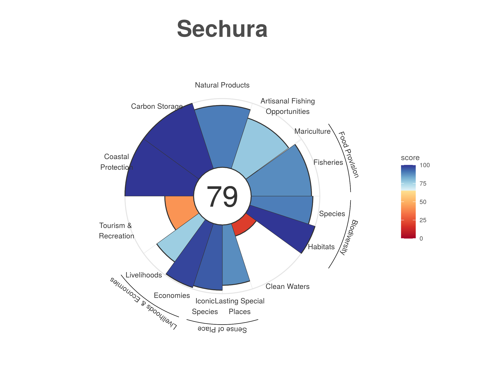

# Ocean Health Index for Bahia de Sechura (Peru) [bsp]

This is the Ocean Health Index repository for Bahia de Sechura (Peru)

**Note** to update `scenario_years` to `2020`, it is required to have back log data of at least 5 years
for each score's input layers.

# Region ID and names

 Id|Name                       | Alias
 --|---------------------------|------
0  | `Bahia de Sechura (Peru)` | 
1  | `Sechura`                 | `Sur BSP`
2  | `Vice`                    | `Norte BSP`

# Transition progress 2019 `mse` to 2020 `bsp`
  - [x] Stash current scores
  - [x] Rename region id 6 to 1 and 7 to 2, also change names (include `rgn_*` layers)
  - [x] `regions_figs.csv` (3 regions: `0` "Bahía de Sechura", `1` "Sur BSP", `2` "Norte BSP")
  - [x] Compare new scores with stashed
  - [x] Rename region ids

## SSH Keys for all users (Add ssh-passwordless access)

## The following changes will produce diffs with current score reference table!
  - [x] Rename `region2019` to `region2020` (diffs due to `scenario_year` changing)
  - [x] Add new `*_bsp2020.csv` layers and update in `layers.csv`
  - [x] Add spatial surface `km2` to `rgn_*.csv` layers
        - [x] Add **NEW** spatial layers and registered in `layers.csv`
        - [x] `reg_area_offshore3nm_bsp2020.csv` (taken from `MAPA BASE10.pdf`)
        - [x] `reg_area_inland1km_bsp2020.csv` (taken from `MAPA BASE10.pdf`)
  - [x] `regions_list.csv` new region names and km2 units (taken from geojson file)
  - [x] geojson file of `AE_200MN` with the two regions, with the following features
```{geojson}
{
"type": "FeatureCollection",
"crs":{
  "type":"name",
  "properties":{
    "name":"urn:ogc:def:crs:OGC:1.3:CRS84"
  }
},
"features":[
{ "type": "Feature",
  "id":0,
  "properties":{
    "rgn_id":1, 
    "rgn_name":"Sur Bsp", <- cambiado para Sechura
    "area_km2": 35813.45}, 
  "geometry": { "type": "MultiPolygon", "coordinates": ... }
},
  "type": "Feature",
  "id":1,
  "properties":{
    "rgn_id":2,
    "area_km2":10598.97,
    "rgn_name":"Norte Bsp"}, <- cambiado para Vice
  "geometry": { "type": "MultiPolygon", "coordinates": ... }
]
}
```

# Score Tables BSP
Score tables are generated using
`> scores %>% filter(dimension %in% c("status","trend", "score"))`

Available tables

 * 2021/04/26 [Reference (last from mse) `scores_reference.tbl`](scores_reference.tbl)
 * 2021/04/27 [Score table with region ID change (`6` to `1` and `7` to `2`) `scores_bsp_rgns.tbl`](scores_bsp_rgns.tbl)

# Goals Progress Report

goal|region|layer issues | action  | Completion 
----|------|-------------|---------|-------------
FIS | GL   | <span style="color:orange">Global data  </span> | Use local data | 0%
MAR | GL   | <span style="color:orange">Global data  </span> | Use local data | 0%
FP  | GL   | <span style="color:orange">Global data  </span> | Use local data | 0%
AO  | MSE  | <span style="color:red">   MSE data     </span> | Use local data | 0%
NP  | GL   | <span style="color:orange">Global data  </span> | Use local data | 0%
CS  | MSE  | <span style="color:red">   MSE data     </span> | Use local data | 0%
CP  | MSE  | <span style="color:red">   MSE data     </span> | Use local data | 0%
TR  | MSE  | <span style="color:red">   MSE data     </span> | Use local data | 0%
LIV | MSE  | <span style="color:red">   MSE data     </span> | Use local data | 0%
ECO | MSE  | <span style="color:red">   MSE data     </span> | Use local data | 0%
LE  | MSE  | <span style="color:red">   MSE data     </span> | Use local data | 0%
ICO | MSE  | <span style="color:red"> R Code problems</span >| Fix problem    | 0%
LSP | GL   | <span style="color:orange">Global data  </span> | Use local data | 0%
SP  | GL   | <span style="color:orange">Global data  </span> | Use local data + Fix problem | 0%
CW  | MSE  | <span style="color:red">   MSE data     </span> | Use local data | 0%
HAB | MSE  | <span style="color:red">   MSE data     </span> | Use local data | 0%
SPP | MSE  | <span style="color:red">   MSE data     </span> | Use local data | 0%
BD  | MSE  | <span style="color:red">   MSE data     </span> | Use local data | 0%
**rgn**|BSP| Complete                                        | local data     | 100%

# Plots

<table><tr>
<td></td>
<td></td>
<td></td>
</tr></table>

# To Do list
  * Plot flower
```
Using layers/fp_wildcaught_weight_gl2018.csv to plot FIS and MAR with unequal weighting
```

## FIXME in `functions.R`
  - [x] Fixme L313
```
313:  # FIXME MSE UPDATE: Filter to return only regions of interest 1:2 !
314-  # All uninhabited regions 1:250 are forced to zero (i.e. this edition
315-  # does not include island data)
```
  - [ ] Fixme L1068
```
1068:  # FIXME NOTE: scripts and related files for calculating these subgoals is located:
1069-  # mse/archive
1070-  # These data are no longer available and status/trend have not been updated since 2013
```
  - [ ] Fixme L1102
```
1102:  # FIXME NOTE: scripts and related files for calculating these subgoals is located:
1103-  # mse/archive
1104-  # These data are no longer available and status/trend have not been updated since 2013
```

## Scores (BSP and GL data)
```
> FIS(layers)
`summarise()` has grouped output by 'region_id'. You can override using the `.groups` argument.
  region_id   score dimension goal
1         1 58.3000    status  FIS
2         2 58.3000    status  FIS
3         1  0.0529     trend  FIS
4         2  0.0529     trend  FIS

```
```
> AO(layers)
  region_id    score dimension goal
1         1 100.0000    status   AO
2         2 100.0000    status   AO
3         1   0.0777     trend   AO
4         2   0.0000     trend   AO

```
```
> ECO(layers)
  region_id goal dimension   score
1         1  ECO    status 95.7472
2         2  ECO    status 95.7472
3         1  ECO     trend  0.5700
4         2  ECO     trend  0.5700
```
```
> LIV(layers)
  region_id goal dimension     score
1         1  LIV    status 76.051906
2         2  LIV    status 76.051906
3         1  LIV     trend -0.082433
4         2  LIV     trend -0.082433
 
```

```
> TR(layers)
  region_id goal dimension   score
1         1   TR    status 97.1831
2         2   TR    status 97.1831
3         1   TR     trend -0.0201
4         2   TR     trend -0.0201
```
```
> NP(scores,layers)
`summarise()` has grouped output by 'year', 'region_id'. You can override using the `.groups` argument.
`summarise()` has grouped output by 'region_id', 'year'. You can override using the `.groups` argument.
Joining, by = c("year", "region_id", "product")
`summarise()` has grouped output by 'region_id'. You can override using the `.groups` argument.
# A tibble: 4 x 4
  goal  dimension region_id   score
  <chr> <chr>         <int>   <dbl>
1 NP    status            1 84.0   
2 NP    status            2 84.0   
3 NP    trend             1  0.0883
4 NP    trend             2  0.0883
>
```
