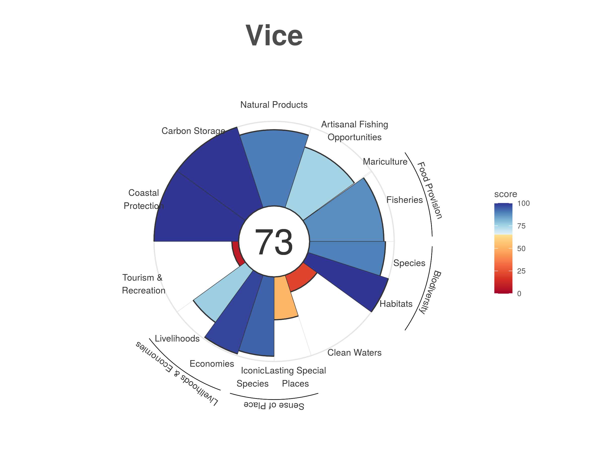

# Pruba de sincronizacion: lelys
# Ocean Health Index for Bahia de Sechura (Peru) [bsp]

This is the Ocean Health Index repository for Bahia de Sechura (Peru)

**Note** to update `scenario_years` to `2020`, it is required to have back log data of at least 4 (5?) years
for each score's input layers.

# Region ID and names

 Id|Name                       | Alias
 --|---------------------------|------
0  | `Bahia de Sechura (Peru)` | 
1  | `Sechura`                 | `Sur BSP`
2  | `Vice`                    | `Norte BSP`

# Transition progress 2019 `mse` to 2020 `bsp`
  - [x] Stash current scores
  - [x] Rename region id 6 to 1 and 7 to 2, also change names (include `rgn_*` layers)
  - [x] `regions_figs.csv` (3 regions: `0` "Bahía de Sechura", `1` "Sur BSP", `2` "Norte BSP")
  - [x] Compare new scores with stashed
  - [x] Rename region ids
  
## The following changes will produce diffs with current score reference table!
  - [x] Rename `region2019` to `region2020` (diffs due to `scenario_year` changing)
  - [x] Add new `*_bsp2020.csv` layers and update in `layers.csv`
  - [x] Add spatial surface `km2` to `rgn_*.csv` layers
        - [x] Add **NEW** spatial layers and registered in `layers.csv`
        - [x] `reg_area_offshore3nm_bsp2020.csv` (taken from `MAPA BASE10.pdf`)
        - [x] `reg_area_inland1km_bsp2020.csv` (taken from `MAPA BASE10.pdf`)
  - [x] `regions_list.csv` new region names and km2 units (taken from geojson file)
  - [x] geojson file of `AE_200MN` with the two regions, with the following features
```{geojson}
{
"type": "FeatureCollection",
"crs":{
  "type":"name",
  "properties":{
    "name":"urn:ogc:def:crs:OGC:1.3:CRS84"
  }
},
"features":[
{ "type": "Feature",
  "id":0,
  "properties":{
    "rgn_id":1, 
    "rgn_name":"Sur Bsp", <- cambiado para Sechura
    "area_km2": 35813.45}, 
  "geometry": { "type": "MultiPolygon", "coordinates": ... }
},
  "type": "Feature",
  "id":1,
  "properties":{
    "rgn_id":2,
    "area_km2":10598.97,
    "rgn_name":"Norte Bsp"}, <- cambiado para Vice
  "geometry": { "type": "MultiPolygon", "coordinates": ... }
]
}
```

# Score Tables BSP
Score tables are generated using
`> scores %>% filter(dimension %in% c("status","trend", "score"))`

Available tables

 * 2021/04/26 [Reference (last from mse) `scores_reference.tbl`](scores_reference.tbl)
 * 2021/04/27 [Score table with region ID change (`6` to `1` and `7` to `2`) `scores_bsp_rgns.tbl`](scores_bsp_rgns.tbl)

# Goals Progress Report

goal|region|layer issues | action  | Completion 
----|------|-------------|---------|-------------
FIS | GL   | <span style="color:orange">Global data  </span> | Use local data | 0%
MAR | GL   | <span style="color:orange">Global data  </span> | Use local data | 0%
FP  | GL   | <span style="color:orange">Global data  </span> | Use local data | 0%
AO  | MSE  | <span style="color:red">   MSE data     </span> | Use local data | 0%
NP  | GL   | <span style="color:orange">Global data  </span> | Use local data | 0%
CS  | MSE  | <span style="color:red">   MSE data     </span> | Use local data | 0%
CP  | MSE  | <span style="color:red">   MSE data     </span> | Use local data | 0%
TR  | MSE  | <span style="color:red">   MSE data     </span> | Use local data | 0%
LIV | MSE  | <span style="color:red">   MSE data     </span> | Use local data | 0%
ECO | MSE  | <span style="color:red">   MSE data     </span> | Use local data | 0%
LE  | MSE  | <span style="color:red">   MSE data     </span> | Use local data | 0%
ICO | MSE  | <span style="color:red"> R Code problems</span >| Fix problem    | 0%
LSP | GL   | <span style="color:orange">Global data  </span> | Use local data | 0%
SP  | GL   | <span style="color:orange">Global data  </span> | Use local data + Fix problem | 0%
CW  | MSE  | <span style="color:red">   MSE data     </span> | Use local data | 0%
HAB | MSE  | <span style="color:red">   MSE data     </span> | Use local data | 0%
SPP | MSE  | <span style="color:red">   MSE data     </span> | Use local data | 0%
BD  | MSE  | <span style="color:red">   MSE data     </span> | Use local data | 0%
**rgn**|BSP| Complete                                        | local data     | 100%

# Plots

<table><tr>
<td></td>
<td></td>
<td></td>
</tr></table>

# To Do list
  * Plot flower
```
Using layers/fp_wildcaught_weight_gl2018.csv to plot FIS and MAR with unequal weighting
```

## FIXME in `functions.R`
  - [x] Fixme L313
```
313:  # FIXME MSE UPDATE: Filter to return only regions of interest 1:2 !
314-  # All uninhabited regions 1:250 are forced to zero (i.e. this edition
315-  # does not include island data)
```
  - [ ] Fixme L1068
```
1068:  # FIXME NOTE: scripts and related files for calculating these subgoals is located:
1069-  # mse/archive
1070-  # These data are no longer available and status/trend have not been updated since 2013
```
  - [ ] Fixme L1102
```
1102:  # FIXME NOTE: scripts and related files for calculating these subgoals is located:
1103-  # mse/archive
1104-  # These data are no longer available and status/trend have not been updated since 2013
```

## Scores (MSE and GL data)
```
> AO(layers)
  region_id   score dimension goal
1         6 80.7150    status   AO
2         7 82.3390    status   AO
3         6  0.0298     trend   AO
4         7  0.0741     trend   AO

```
```
> CS(layers)
# A tibble: 4 x 4
  goal  dimension region_id  score
  <chr> <chr>         <int>  <dbl>
1 CS    status            6 21.0  
2 CS    status            7 19.5  
3 CS    trend             6 -1    
4 CS    trend             7 -0.619
```
```
> CP(layers)
# A tibble: 4 x 4
  region_id goal  dimension  score
      <int> <chr> <chr>      <dbl>
1         6 CP    status    21.0  
2         7 CP    status    19.5  
3         6 CP    trend     -1    
4         7 CP    trend     -0.619
> 
```
### TR: revision required

```
> TR(layers)
  region_id goal dimension    score
1         6   TR    status 97.96545
2         7   TR    status 69.08675
3         6   TR     trend -0.02480
4         7   TR     trend -0.05590
```
```
> LIV(layers)
  region_id goal dimension      score
1         6  LIV    status 98.9924668
2         7  LIV    status 98.9924668
3         6  LIV     trend  0.9519295
4         7  LIV     trend  0.9342872
```
```
> ECO(layers)
  region_id goal dimension       score
1         6  ECO    status  97.3600000
2         7  ECO    status 100.0000000
3         6  ECO     trend   0.4523954
4         7  ECO     trend  -1.0000000
```
```
> CW(layers)
  region_id goal dimension       score
1         6   CW    status 72.29151383
2         7   CW    status 79.40565609
3         6   CW     trend -0.09486703
4         7   CW     trend -0.25114921
```


```
> SPP(layers)
  region_id goal dimension        score
1         6  SPP    status 94.824902700
2         7  SPP    status 94.824902700
3         6  SPP     trend -0.004867257
4         7  SPP     trend -0.004867257
```


### ICO: gives R code error
```
> ICO(layers)
Error in tbl_vars(y) : object 'un_regions' not found
Called from: tbl_varsy)
```

```
> HAB(layers)
# A tibble: 4 x 4
  region_id goal  dimension  score
      <int> <chr> <chr>      <dbl>
1         6 HAB   status    37.9  
2         7 HAB   status    37.9  
3         6 HAB   trend     -0.876
4         7 HAB   trend     -0.674
```

```
> SPP(layers)
  region_id goal dimension        score
1         6  SPP    status 94.824902700
2         7  SPP    status 94.824902700
3         6  SPP     trend -0.004867257
4         7  SPP     trend -0.004867257
```
